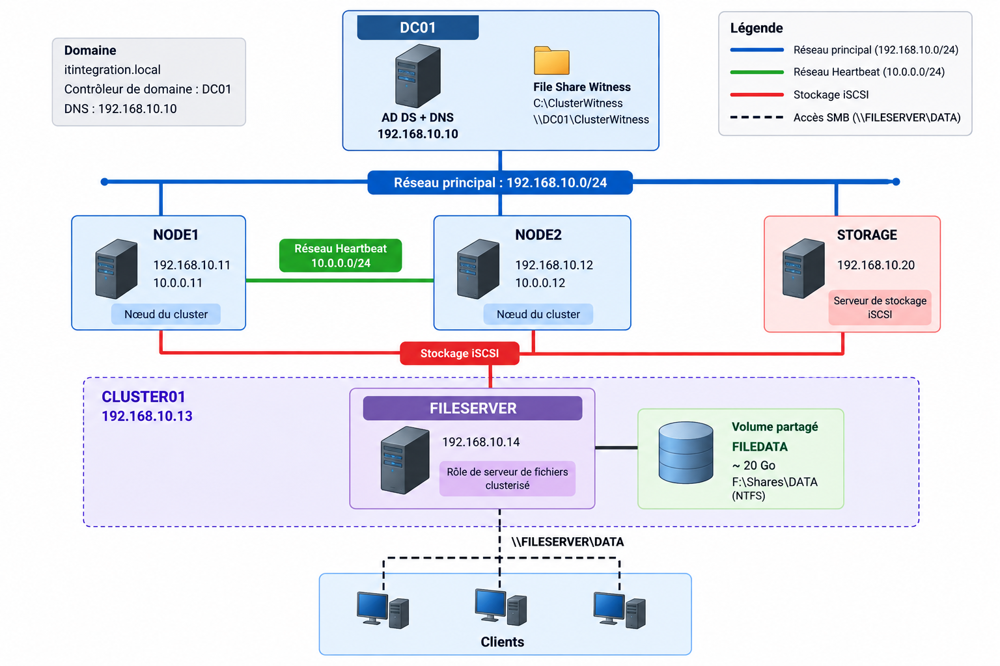
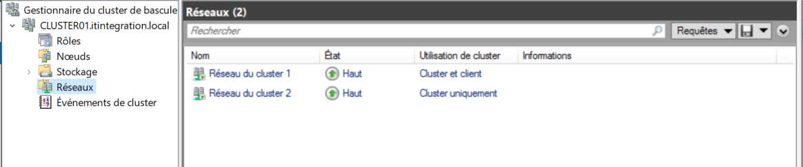
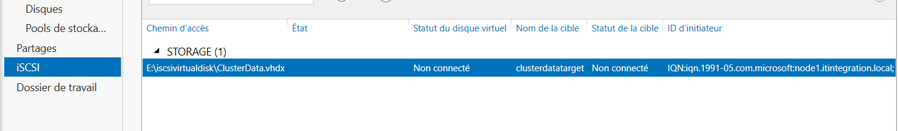
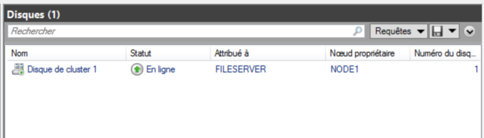
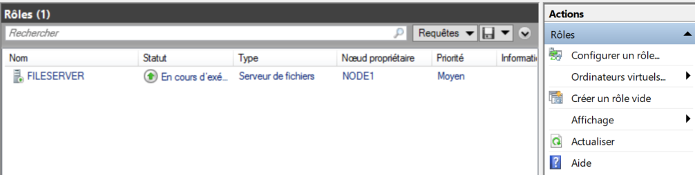
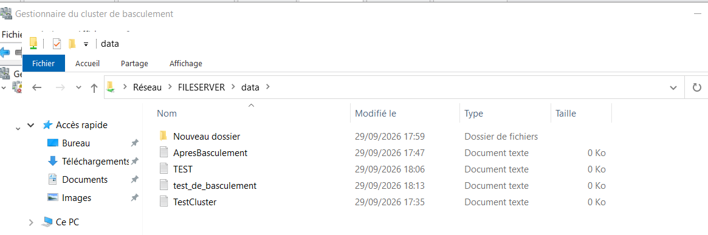

# Windows Server 2022 Failover Cluster Lab

## 📌 Overview

This project documents the design, deployment, configuration and testing of a high-availability infrastructure based on **Windows Server 2022**.

The laboratory environment was implemented using **VMware Workstation**.

The solution is based on two cluster nodes, a shared iSCSI storage server, a domain controller and a template virtual machine.

The main objective is to provide a highly available file service that remains accessible when one of the cluster nodes becomes unavailable.

---

## 🏗️ Architecture

The laboratory consists of five virtual machines:

| Virtual Machine | Role | IP Address |
|---|---|---|
| `DC01` | Active Directory / DNS | `192.168.10.10` |
| `NODE1` | Cluster Node | `192.168.10.11` |
| `NODE2` | Cluster Node | `192.168.10.12` |
| `STORAGE` | iSCSI Storage Server | `192.168.10.20` |
| `WIN2022-TEMPLATE` | Virtual Machine Template | — |

The Failover Cluster is named:

`CLUSTER01`

with the virtual IP address:

`192.168.10.13`

The clustered file server role is named:

`FILESERVER`

with the virtual IP address:

`192.168.10.14`

The Active Directory domain used in the laboratory is:

`itintegration.local`

### Network Configuration

Two main networks are used in the environment:

| Network | Subnet | Purpose |
|---|---|---|
| Main Network | `192.168.10.0/24` | Domain, storage and client communication |
| Heartbeat Network | `10.0.0.0/24` | Communication between cluster nodes |

The heartbeat interfaces are configured as follows:

| Node | Heartbeat IP |
|---|---|
| `NODE1` | `10.0.0.11` |
| `NODE2` | `10.0.0.12` |

### Architecture Diagram

---

## 🔧 Technologies

- Windows Server 2022
- VMware Workstation
- Active Directory Domain Services
- DNS
- Failover Clustering
- iSCSI
- SMB
- PowerShell
- NTFS
- File Share Witness

---

## 🧩 Cluster Components

### Failover Cluster

The cluster is named:

`CLUSTER01`

It contains two nodes:

- `NODE1`
- `NODE2`

Both nodes are configured to host the clustered file server role.

### Shared Storage

The shared storage is provided by:

`STORAGE`

A 30 GB disk was added to STORAGE and prepared as NTFS with the drive letter `E:` and the label `ISCSI`.

A 20 GB fixed-size iSCSI virtual disk was then created at:

`E:\iscsivirtualdisk\ClusterData.vhdx`

The iSCSI target is named:

`clusterdatatarget`

Access was authorized for both cluster nodes using their respective IQNs.

### Cluster Storage

The shared disk was integrated into the Failover Cluster and appears as:

`Disque de cluster 1`

The volume used by the file server role is:

`FILEDATA`

It is formatted in NTFS and has a capacity of approximately 20 GB.

The volume was assigned the drive letter:

`F:`

### Quorum

A **File Share Witness** was configured on `DC01`.

The witness share is:

`\\DC01\ClusterWitness`

The computer account `CLUSTER01$` was granted the required permissions on the witness share.

### Clustered File Server

A general-purpose clustered file server role named:

`FILESERVER`

was created in `CLUSTER01`.

The role can run on either:

- `NODE1`
- `NODE2`

Its virtual IP address is:

`192.168.10.14`

The local data path is:

`F:\Shares\DATA`

The SMB share is:

`\\FILESERVER\DATA`

The **Continuous Availability** feature was enabled for the share.

---

## 🧪 Tests Performed

Several tests were performed to verify the operation and availability of the infrastructure.

### Network Tests

The following elements were verified:

- Connectivity between the infrastructure components
- DNS resolution
- Connectivity with the domain controller
- Resolution of `FILESERVER`
- Heartbeat communication between `NODE1` and `NODE2`

The `FILESERVER` name resolved to:

`192.168.10.14`

## 📸 Screenshots

### Failover Cluster

### iSCSI Storage

### Cluster Storage

### Clustered File Server

### SMB Share

### SMB Tests

SMB connectivity was tested using:

`Test-NetConnection FILESERVER -Port 445`

The test confirmed that TCP port 445 was accessible.

### Shared Folder Test

The following SMB share was tested:

`\\FILESERVER\DATA`

A test file named:

`TestCluster.txt`

was successfully created and read from the share.

### Manual Failover

The `FILESERVER` role was manually moved from one cluster node to the other using **Failover Cluster Manager**.

After the migration:

- the role remained operational;
- the `DATA` share remained accessible;
- a new file could still be created.

**Result:** Manual failover successful.

### Automatic Failover

An automatic failover scenario was tested by making `NODE1` unavailable while it was hosting the `FILESERVER` role.

The cluster detected the node failure and automatically moved the `FILESERVER` role to `NODE2`.

The SMB share remained accessible after the failover.

**Result:** Automatic failover successful.

### Data Integrity Verification

After the failover, the data stored in the share remained accessible.

A new file was created after the failover to verify that the file service continued to operate correctly.

**Result:** Data remained accessible before and after failover.

---

## 📊 Results

The laboratory successfully demonstrated:

- A two-node Windows Server 2022 Failover Cluster
- Active Directory and DNS integration
- Shared storage using iSCSI
- File Share Witness configuration
- A clustered SMB file server
- Manual failover
- Automatic failover
- Continued access to shared data after failover

The final infrastructure includes:

| Component | Configuration |
|---|---|
| Domain | `itintegration.local` |
| Cluster | `CLUSTER01` |
| Node 1 | `NODE1` — `192.168.10.11` |
| Node 2 | `NODE2` — `192.168.10.12` |
| Storage | `STORAGE` — `192.168.10.20` |
| Shared Volume | `FILEDATA` — ~20 GB |
| File Server Role | `FILESERVER` |
| File Server IP | `192.168.10.14` |
| SMB Share | `\\FILESERVER\DATA` |
| Quorum | File Share Witness on `DC01` |

---

## 📚 Documentation

The repository contains the technical documentation, architecture diagrams, configuration screenshots, PowerShell scripts and troubleshooting information.

### Technical Report

The complete technical report is available in:

`docs/rapport-technique.pdf`

### Architecture

Architecture documentation and diagrams are available in:

`architecture/`

### Screenshots

Configuration and testing screenshots are organized by topic:

- `screenshots/01-domain/`
- `screenshots/02-cluster/`
- `screenshots/03-iscsi/`
- `screenshots/04-fileserver/`
- `screenshots/05-tests/`

### PowerShell

PowerShell scripts used for configuration and verification are available in:

`powershell/`

### Troubleshooting

Problems encountered during the implementation and their solutions are documented in:

`troubleshooting/`

---

## 🎯 Learning Objectives

This project was carried out to develop practical skills in:

- Windows Server administration
- Active Directory and DNS
- High-availability infrastructure
- Failover Clustering
- Shared storage with iSCSI
- SMB file services
- Network configuration
- PowerShell administration
- Infrastructure troubleshooting
- Virtualized laboratory environments

---

## ⚠️ Troubleshooting

Several issues were encountered during the implementation, including:

- WMI error `0x80041014`
- A validation error related to Hyper-V configuration
- QFE error `0x8024402C`
- Initial identification issues with the `STORAGE` server
- Microsoft iSCSI service initially stopped
- Initial formatting issue with the cluster-managed disk
- Requirement to assign the `F:` drive letter to the `FILEDATA` volume

These issues did not prevent the final implementation of the cluster.

Detailed explanations and solutions will be documented in:

`troubleshooting/issues-and-solutions.md`

---

## 🎓 Project Outcome

This laboratory provided practical experience in implementing and administering a Windows Server 2022 high-availability infrastructure.

The final environment successfully demonstrated the operation of a clustered file service using Failover Clustering, shared iSCSI storage, File Share Witness and SMB.

---

## ⚠️ Disclaimer

This project was implemented in a virtualized laboratory environment using VMware Workstation.

It is intended for **educational, testing and demonstration purposes** and does not represent a production deployment.

---

## 👤 Author

**Monhamad**

GitHub:

`https://github.com/monhamad`
